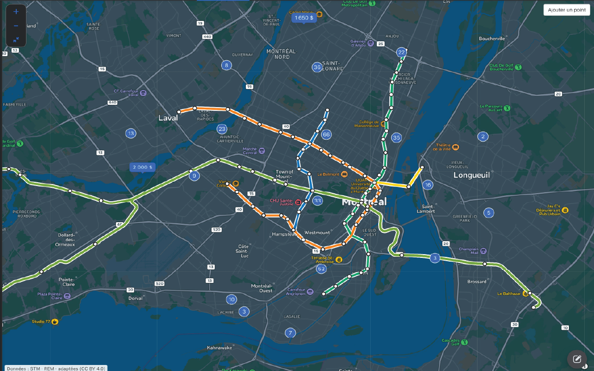

# Transport en commun pour Marketplace et Centris

A Chrome extension that overlays rapid transit lines and stations on housing maps in Facebook Marketplace and Centris: Montréal's métro and the REM, Toronto's TTC subway and light rail, the six French métros — Paris, with the RER alongside it, plus Lyon, Marseille, Lille, Toulouse and Rennes — and the subways of ten American cities: New York, with the Staten Island Railway and PATH, Washington, Chicago, Boston, the San Francisco Bay Area's BART, Philadelphia, Los Angeles, Atlanta, Miami and Baltimore. The interface is in English and French: it follows the browser's language unless another is chosen in the settings.



## Features

- Transit overlays on supported search maps, listing maps, and Marketplace map previews.
- Individual switches for sites, transit operators and their lines, stations, labels, and map controls.
- Station names that never overlap one another or a station's dot. Where they don't all fit, the stations with the most lines are named first, and the rest appear as the map zooms in. While a zoom is under way the names hold their places, and they are laid out again once it stops.
- Custom landmarks from coordinates or full Google Maps links, with editable names and colours.
- A toolbar switch to enable or disable the overlay without losing your settings.
- An English and French interface, in the browser's language by default, with a language picker in the settings.
- A panel on the map naming the city being drawn and listing the rest by country, where clicking a city switches its network on or off and switching one on switches the others off — the map draws a single city. On Marketplace, the arrow beside a city jumps the search to it with its network switched on.
- A second panel under it for the lines of the city being drawn, as the bullets their own networks print them on, with a switch per operator and one pair of buttons for all of them at once. Only one of the two panels is open at a time.
- Networks swapped as the map moves between cities, without a reload: the panel says which one is loading, keeps each city once it has been fetched, and offers to try again if one does not arrive.
- On a Marketplace search, a button on the map's right edge that hides the listings beside it so the map takes the whole width, and brings them back. The next search opens the way the last one was left.

This is an independent project, unaffiliated with Meta/Facebook, Centris, Local Logic, the STM, the REM, the TTC, the City of Toronto, or any of the French or American transit authorities, operators and governments whose data it uses. The bundled network is a snapshot, not a live service or journey planner. Changes to those sites can affect map detection.

## Install from source

1. Clone this repository or download and extract its source archive.
2. Open `chrome://extensions` in Chrome and enable **Developer mode**.
3. Choose **Load unpacked** and select the **`extension/` folder**, which contains `manifest.json`.
4. Open a housing map on [Facebook Marketplace](https://www.facebook.com/marketplace/) or [Centris](https://www.centris.ca/). Reload an existing tab after installing or updating.

No build, API key, or developer account is needed to load the extension. Click its toolbar icon to toggle the overlay; open its **Options** or the map's gear button to change settings.

## Privacy and permissions

The extension uses `chrome.storage.local` for settings, landmarks, whether the listings beside a Marketplace search were last left hidden, and the name of the last supported city a map showed the network for — one of the eighteen names in the registry, never a position. It loads its transit data from the installed extension and has no analytics or developer backend. Google Maps links are parsed locally; shortened links must first be opened by the user to obtain a full link containing coordinates.

The only declared API permission is `storage`. Content scripts run on Marketplace, Centris, and the Local Logic frame used by Centris listings. The Local Logic adapter checks that Centris embedded the frame. Its page-world bridge reads the map's camera so the overlay follows it.

Landmarks are drawn into the host page, so scripts on that page can read their displayed names and locations. Resetting settings preserves landmarks; delete them individually or uninstall the extension to remove them. See the [privacy policy](https://metro.odeschenes.dev/confidentialite) and [security policy](SECURITY.md).

## Development

Use **Node.js 24** for checks and the website. Python **3.13 or newer** is needed only for packaging or rebuilding transit data.

```sh
# Extension regression and package-integrity checks; no npm install needed here
npm test

# Build a distributable ZIP using only approved extension files and notices
python scripts/package_extension.py

# Website
cd web
npm ci
npm run dev
```

The ZIP is written to `dist/browser-transit-overlay-<version>.zip`, with `manifest.json` at its root. Generated archives are not committed. Unpack the ZIP before loading it through Chrome's **Load unpacked** option.

For website build and deployment details, see [web/README.md](web/README.md). To regenerate the bundled transit network, see [data/README.md](data/README.md). Both local development and CI work without Cloudflare credentials.

## How transit networks fit together

Networks are organised by city. Every line has a three-part id, such as `montreal:stm:1` (city, operator, line), and that id is shared from the data sources to the saved switches.

```text
data/stm_sig/, rem_data/,           source shapefiles, GTFS and map layers
data/ttc_gtfs/, data/idfm_gtfs/,
data/tcl_sytral/, data/rtm_gtfs/,
data/ilevia_gtfs/, data/tisseo_gtfs/,
data/star_gtfs/, data/mta_gtfs/,
data/path_gtfs/, data/wmata_dcgis/,
data/cta_gtfs/, data/mbta_gtfs/,
data/bart_gtfs/, data/septa_gtfs/,
data/lametro_gtfs/, data/marta_gtfs/,
data/miamidade_gtfs/, data/mdotmta_gtfs/
        │
data/scripts/cities/<city>.py       maps feed routes to public line ids
        │  data/scripts/build_networks.py
        │  (uses transit_geometry.py and gtfs_network.py)
        ▼
extension/networks/<city>.json      geometry only: ids, paths, stations, notice
        ▲
        │  fetched by content.js for the city the map is showing
extension/networks.js               registry: ids, colours, bounds, attribution,
        │                           country, and kind of service
        ├─ settings.js / options.js  a switch for each city, operator, and line,
        │                            browsed by country, city, and service
        └─ content.js + sites.js     draws lines on Marketplace, Centris, and Local Logic maps

extension/i18n.js                   every word shown, per language, including what
                                    each country, city, operator, line, and kind
                                    of service is called
```

- **[`data/scripts/cities/`](data/scripts/cities/)** is the only place where GTFS route ids or shapefile route ids appear. [`montreal.py`](data/scripts/cities/montreal.py) combines the STM métro and the REM into one city; [`toronto.py`](data/scripts/cities/toronto.py) takes the TTC's subway and light rail out of one city-wide feed; [`paris.py`](data/scripts/cities/paris.py) takes the métro and the RER out of Île-de-France Mobilités' feed for the whole region; [`lyon.py`](data/scripts/cities/lyon.py) is built from SYTRAL's map layers rather than its feed, which draws no métro at all. [`new_york.py`](data/scripts/cities/new_york.py) combines the MTA's feed with PATH's; [`washington.py`](data/scripts/cities/washington.py) is built from the District of Columbia's map layers, since WMATA's own feed is behind a developer key; [`miami.py`](data/scripts/cities/miami.py) splits the one route Miami-Dade publishes for Metrorail into its two lines.
- **[`data/scripts/build_networks.py`](data/scripts/build_networks.py)** writes one file per city in [`CITIES`](data/scripts/cities/__init__.py) to [`extension/networks/`](extension/networks/). Shared simplification, deduplication, and rounding live in [`transit_geometry.py`](data/scripts/transit_geometry.py), and what every GTFS city needs done to its feed lives in [`gtfs_network.py`](data/scripts/gtfs_network.py).
- **[`extension/networks.js`](extension/networks.js)** declares each city's operators, lines, colours, map bounds, data file, and the licence each operator's data was published under. Geometry files never repeat this information. A city also names the country it is in and an operator the kind of service it runs — métro, regional rail, light rail — which a line may override for itself; neither is a level of id, and nothing is stored against them.
- **[`extension/settings.js`](extension/settings.js)** gets its defaults from the registry, so a new operator or line is switched on without a settings migration; the cities are the exception, since exactly one of them is on at a time and a new one ships off until it is picked. [`options.js`](extension/options.js) builds the settings page from the same registry: the lines are shown as a card per city, over a search and filters for country and kind of service, and whatever the filters leave standing is what the page's buttons switch on or off together. The panel on the map writes the same switches for the one city being drawn, so the two forms are two views of one set of settings rather than two sets.
- **[`extension/i18n.js`](extension/i18n.js)** names each country, city, operator, line, and kind of service by its id, in every language, next to the rest of the interface's text.
- **[`extension/content.js`](extension/content.js)** chooses the city whose bounds contain the viewport, loads its geometry, and draws it through the site adapter selected in [`sites.js`](extension/sites.js). A change of city replaces the drawing rather than the overlay around it, so the panel in the corner stays up to say what is loading; geometry already fetched is kept for the rest of the page's life, and the city last drawn is stored so the next page starts its guess there.
- **[`tests/networks.test.mjs`](tests/networks.test.mjs)** checks that the registry and generated geometry list the same lines, and that each city's bounds contain everything it draws.

To add a city, follow [Add a city](data/README.md#add-a-city). The data licences for each network are listed in [THIRD_PARTY_NOTICES.md](THIRD_PARTY_NOTICES.md).

## Languages

Everything the extension shows lives in [`extension/i18n.js`](extension/i18n.js), with one block of messages per language. The setting defaults to `auto`, which picks the first of the browser's preferred languages (`navigator.languages`) that has a block and falls back to English. The settings page can pin a language instead. The settings page, the map controls, and the toolbar button all switch languages right away, without a reload.

Brand names, operator acronyms, licence titles, and station names are the same in every language and are not translated.

### Add a language

1. In [`extension/i18n.js`](extension/i18n.js), copy an existing block in `STM_LOCALES` under the new language code (for example `es`, or `pt-BR`), set `name` to the language's name in that language, and translate every message. Keep each `{placeholder}` as it is.
2. Copy `extension/_locales/en/` to a folder named with [Chrome's code for the language](https://developer.chrome.com/docs/extensions/reference/api/i18n#locales) (`es`, `pt_BR`), and translate `extName` and `extDescription`. Chrome reads the extension's own name and description from there, and `extName` must match the block's `extension.name`.
3. Run `npm test`. [`tests/i18n.test.mjs`](tests/i18n.test.mjs) lists any message the new block is missing or has extra, any placeholder that doesn't match, and any `_locales` folder that doesn't match a block.

The new language then appears in the settings page's language list, and browsers that prefer it pick it automatically. Nothing else needs to be registered: the manifest, the options page, and the packaging script already pick it up.

Adding a message works the same way. Add it to every block, and write the key out in full where it is used (`stmText("map.loading")`) so the tests can find it.

## Repository layout

| Path | Purpose |
| --- | --- |
| [`extension/`](extension/) | Manifest V3 extension: [network registry](extension/networks.js), [languages](extension/i18n.js), [settings](extension/settings.js), [site adapters](extension/sites.js), [station name placement](extension/labels.js), and [bundled geometry](extension/networks/) |
| [`web/`](web/) | TanStack Start / React / Tailwind website: a map of every supported line, and the support and privacy pages ([guide](web/README.md)) |
| [`data/`](data/) | STM, TTC and French source files and the [per-city network generators](data/scripts/cities/) ([guide](data/README.md)) |
| [`rem_data/`](rem_data/) | REM GTFS source subset and original licence |
| [`scripts/`](scripts/) | Reproducible [extension packaging](scripts/package_extension.py) |
| [`tests/`](tests/) | Extension behaviour, [network registry](tests/networks.test.mjs), [translations](tests/i18n.test.mjs), [station name placement](tests/labels.test.mjs), and resource checks |
| [`docs/`](docs/) | Screenshot and [release instructions](docs/RELEASING.md) |

## Contributing and releases

Bug reports and contributions are welcome in English or French. See [CONTRIBUTING.md](CONTRIBUTING.md) for checks and manual testing, and [the release guide](docs/RELEASING.md) before publishing a version. Report security problems privately using [SECURITY.md](SECURITY.md).

## Licence and attribution

Original code and documentation are under the [MIT licence](LICENSE). The bundled transit data keeps the terms it was published under, and those differ by operator: STM and REM data are **CC BY 4.0**; the TTC feed comes from the City of Toronto under the **Open Government Licence – Toronto**; Paris and Lyon are under the **Licence Mobilités** and the **Licence Ouverte 2.0** respectively, as are Marseille and Lille; and Toulouse and Rennes are under the **ODbL 1.0**, whose share-alike condition travels with anything derived from them. Of the American networks, Washington's comes from the District of Columbia's open data portal under **CC BY 4.0**; the MTA, the CTA, MassDOT for the MBTA, BART, SEPTA and LA Metro each publish under a developer agreement or terms of their own, and PATH, MARTA, Miami-Dade and MDOT MTA publish their feeds without a licence. The derived geometry in `extension/networks/` carries the same terms as the data it came from. Third-party branding and map imagery are not covered by the code licence. See [THIRD_PARTY_NOTICES.md](THIRD_PARTY_NOTICES.md) for sources and modifications.
